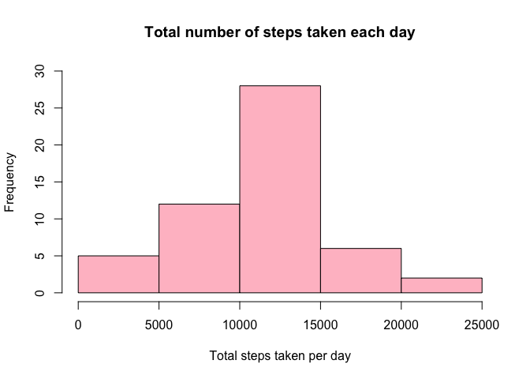
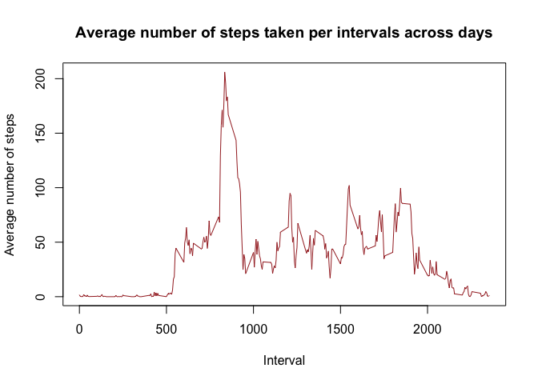
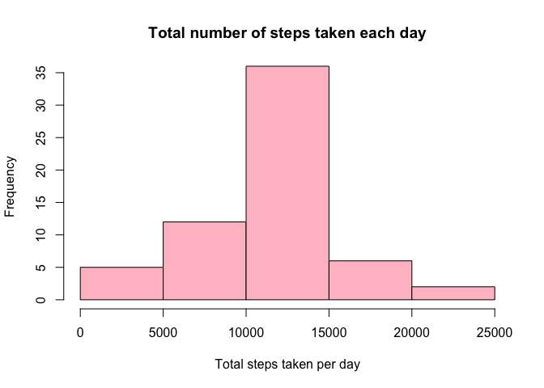
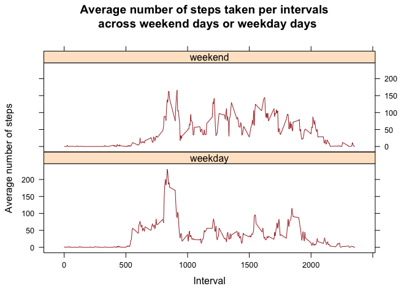

## Loading and preprocessing the data

1. Load the data.

```r
unzip("./activity.zip")
data <- read.csv("./activity.csv")
```

2. Process/transform the data (if necessary) into a format suitable for your analysis.

```r
str(data)
```

```
## 'data.frame':	17568 obs. of  3 variables:
##  $ steps   : int  NA NA NA NA NA NA NA NA NA NA ...
##  $ date    : chr  "2012-10-01" "2012-10-01" "2012-10-01" "2012-10-01" ...
##  $ interval: int  0 5 10 15 20 25 30 35 40 45 ...
```


```r
library(lubridate)
data$date <- ymd(data$date)
```


```r
summary(data)
```

```
##      steps             date               interval     
##  Min.   :  0.00   Min.   :2012-10-01   Min.   :   0.0  
##  1st Qu.:  0.00   1st Qu.:2012-10-16   1st Qu.: 588.8  
##  Median :  0.00   Median :2012-10-31   Median :1177.5  
##  Mean   : 37.38   Mean   :2012-10-31   Mean   :1177.5  
##  3rd Qu.: 12.00   3rd Qu.:2012-11-15   3rd Qu.:1766.2  
##  Max.   :806.00   Max.   :2012-11-30   Max.   :2355.0  
##  NA's   :2304
```

## What is mean total number of steps taken per day?

1. Calculate the total number of steps taken per day.

```r
steps_day <- aggregate(steps ~ date, data, sum, na.rm = TRUE)
```

2. Make a histogram of the total number of steps taken each day.

```r
hist(steps_day$steps, xlab = "Total steps taken per day", main = "Total number of steps taken each day", ylim = c(0, 30), col = "pink")
```

<!-- -->

3. Calculate and report the mean and median of the total number of steps taken per day.

```r
mean(steps_day$steps)
```

```
## [1] 10766.19
```

```r
median(steps_day$steps)
```

```
## [1] 10765
```

## What is the average daily activity pattern?

1. Make a time series plot of the 5-minute interval (x-axis) and the average number of steps taken, averaged across all days (y-axis).

```r
steps_interval <- aggregate(steps ~ interval, data, mean, na.rm = TRUE)
plot(steps ~ interval, steps_interval, type = "l", xlab = "Interval", ylab = "Average number of steps", main = "Average number of steps taken per intervals across days", col = "brown")
```

<!-- -->

2. Which 5-minute interval, on average across all the days in the dataset, contains the maximum number of steps?

```r
steps_interval[which.max(steps_interval$steps), ]$interval
```

```
## [1] 835
```

## Imputing missing values

1. Calculate and report the total number of missing values in the dataset.

```r
sum(is.na(data$steps))
```

```
## [1] 2304
```

2. Devise a strategy for filling in all of the missing values in the dataset. The strategy does not need to be sophisticated.\
My strategy is to use the mean for corresponding 5-minute interval.

```r
imputing_NA <- function(interval) {
    steps_interval[steps_interval$interval == interval, ]$steps
}

data_noNa <- data 
for (i in 1:nrow(data_noNa)) {
    if (is.na(data_noNa[i, ]$steps)) {
        data_noNa[i, ]$steps <- imputing_NA(data_noNa[i, ]$interval)
    }
}
```

3. Create a new dataset that is equal to the original dataset but with the missing data filled in.

```r
steps_day_noNA <- aggregate(steps ~ date, data_noNa, sum)
```

4. Make a histogram of the total number of steps taken each day and Calculate and report the mean and median total number of steps taken per day. Do these values differ from the estimates from the first part of the assignment? What is the impact of imputing missing data on the estimates of the total daily number of steps?

```r
hist(steps_day_noNA$steps, xlab = "Total steps taken per day", main = "Total number of steps taken each day", ylim = c(0, 35), col = "pink")
```

<!-- -->

```r
mean(steps_day_noNA$steps)
```

```
## [1] 10766.19
```

```r
median(steps_day_noNA$steps)
```

```
## [1] 10766.19
```
Mean does not differ from the mean before imputing NAs, on the other hand, median differs just slightly. We can see from histograms that the only bin that differs is the interval between 10 000 and 15 000 steps, which grown from a frequency of ~27 to ~36.

## Are there differences in activity patterns between weekdays and weekends?

1. Create a new factor variable in the dataset with two levels – “weekday” and “weekend” indicating whether a given date is a weekday or weekend day.

```r
data_noNa$weekday <- weekdays(data_noNa$date)
for (i in 1:nrow(data_noNa)) {
    if (data_noNa[i, ]$weekday %in% c("Saturday", "Sunday")) {
        data_noNa[i, ]$weekday <- "weekend"
    }
    else {
        data_noNa[i, ]$weekday <- "weekday"
    }
}
```

2. Make a panel plot containing a time series plot of the 5-minute interval (x-axis) and the average number of steps taken, averaged across all weekday days or weekend days (y-axis).

```r
steps_weekday <- aggregate(data_noNa$steps ~ data_noNa$interval + data_noNa$weekday, data_noNa, mean)
names(steps_weekday) <- c("interval", "day", "steps")

library(lattice)
xyplot(steps ~ interval | day, steps_weekday, type = "l", layout = c(1, 2), xlab = "Interval", ylab = "Average number of steps", main = "Average number of steps taken per intervals \n across weekend days or weekday days", col = "brown")
```

<!-- -->
